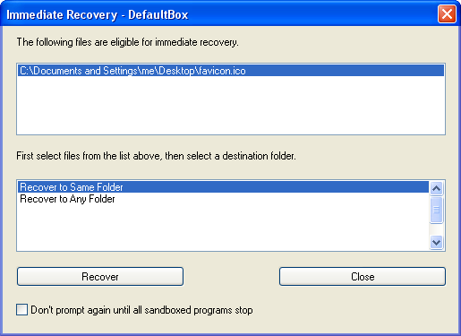

# Immediate Recovery

Immediate Recovery is an extension of [Quick Recovery](QuickRecovery.md). Both Quick and Immediate Recovery scan the list of folders configured in [Sandbox Settings > Recovery > Quick Recovery](RecoverySettings#quick), and suggest an easy way to move any files (or folders) found out of the sandbox.

Quick Recovery is invoked by explicit request, or just before the sandbox is deleted, that is, typically it is invoked after the sandboxed programs have finished running. By contrast, _Immediate Recovery_ works within the sandboxed program, and identifies files as soon as they are created and eligible for recovery.

As soon as a file is eligible for recovery, the _Immediate Recovery_ window appears, and as long as the window stays open, any further files that become eligible for recovery will be collected into that window. The upper area (see picture above) shows the files eligible for recovery, while the lower area lists destination folders.

To recover files, select one or more files in the upper area, then select a folder from the lower area, and click _Recover_. (Use the _CTRL_ and _SHIFT_ keys to select multiple files in the upper area).

The lower area initially offers just the special destinations _Recover to Same Folder_ and _Recover to Any Folder_. These work the same as described in [Quick Recovery](QuickRecovery.md). As you use the _Recover to Any Folder_ command, more destinations will be recorded in the lower area for later use.

*   You can disable this feature by clearing the checkbox _Store selected folders for later use_ in the _Browse For Folder_ dialog box that appears when you invoke the _Recover to Any Folder_ command.

_Immediate Recovery_ can be temporarily disabled until all sandboxed activity stops, by marking the checkbox _Don't prompt again until all sandboxed programs stop_ at the bottom of the window.

* * *

Go to [Quick Recovery](QuickRecovery.md), [Sandboxie Control](SandboxieControl.md), [Help Topics](HelpTopics.md).