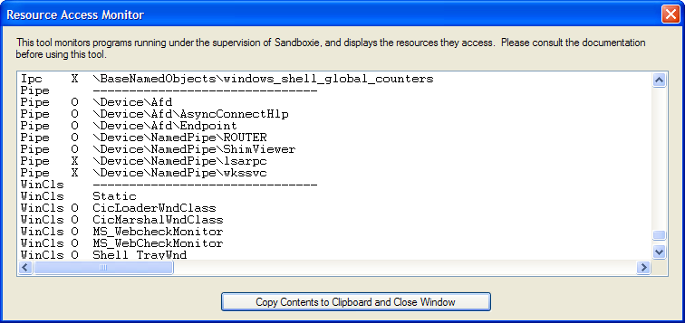

# Resource Access Monitor

The Resource Access Monitor tool displays the names of any system resources that are accessed by programs running under the supervision of Sandboxie. Designed to make it easy to identify those system resources which should be excluded from sandboxing, this tool replaces the older and more cumbersome [Sandboxie Trace](SandboxieTrace.md) facility.

**Important:** Please use the Resource Access Monitor tool only if you are asked to do so.

**Using the Monitor**

1\. To activate the monitor, expand or open the [Sandboxie Control](SandboxieControl.md) window, then select the [File Menu](FileMenu.md) -> Resource Access Monitor command.

2\. You should typically activate the monitor before any programs are running in any sandbox. Note that the Resource Access Monitor window blocks access to the [Sandboxie Control](SandboxieControl.md) main window, including its menu, so you will have to start sandboxed programs through the [Tray Icon Menu](TrayIconMenu.md).

3\. When the monitor is activated and its window appears on the screen, it immediately starts to collect and display resource access information from all sandboxed programs that are running.

4\. At this point, perform any specific tasks that fail when done under the supervision of Sandboxie.

5\. Finally, click the button labeled **Copy Contents to Clipboard and Close Window**. This copies the collected data into the clipboard, and de-activates the monitor.

6\. You can now paste (Ctrl+V) the collected data somewhere and make it available for analysis.

**Performace Impact**

When inactive, the Resource Access Monitor does not use any system resources and does not have any performance impact on any running programs. When active, the Resource Access Monitor consumes 64K bytes of system memory and has a small performace penalty on sandboxed programs. Network Administrators may want to use the [MonitorAdminOnly](MonitorAdminOnly.md) to restrict the use of this commad.
